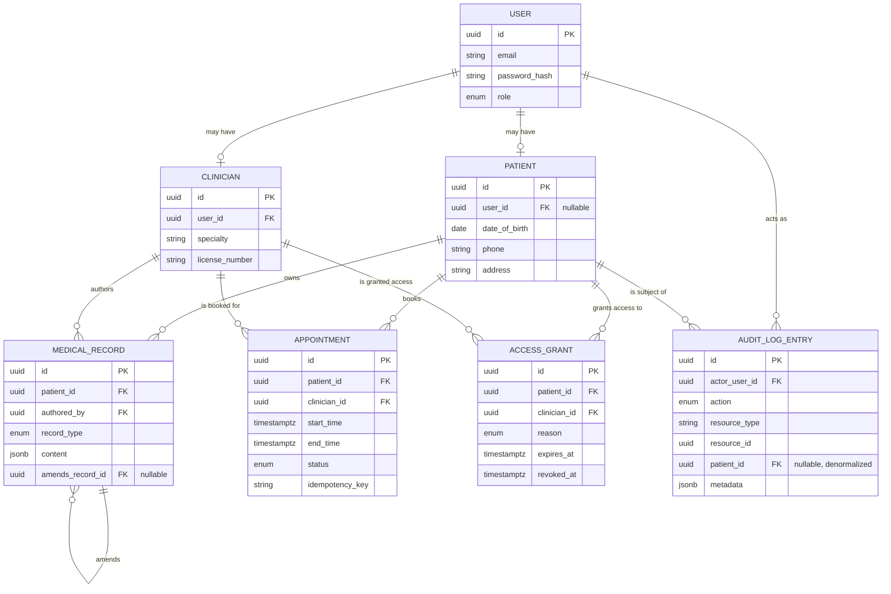

# Patient Records & Appointments API

A healthcare backend built to prove one thing end to end: **access to
sensitive data can be correctly controlled, and every access is provable
after the fact.** Where a wallet/ledger API proves you can handle money
correctly under concurrency, this project proves you can handle *access*
correctly under compliance-style constraints.

Node.js 20+ · TypeScript (strict) · Express · PostgreSQL 15 · Prisma ·
Redis · JWT · Zod · Vitest · Docker Compose

---

## Architecture overview



**Request flow for a sensitive read** (`GET /records/:id`, the representative
case): `requireAuth` verifies the JWT → the route calls into
`records/service.ts` → inside a single `prisma.$transaction`, the record is
fetched, the **policy layer** (`modules/policy/*`) decides allow/deny
(checking `AccessGrant` if the actor is a clinician), and a raw-SQL
`AuditLogEntry` insert is written for the decision — *whether or not it was
a denial*. Only after that transaction commits does the service decide
whether to return the record or throw a `403`. See [Design decisions →
audit-before-throw](#why-a-denied-read-still-has-to-commit-something) for
why the ordering matters.

```
Request → requireAuth → Router → Service (policy check + DB op + audit write,
                                            all in one transaction) → commit
                                          → then throw 403/404, or return 200
```

### Project layout

```
src/
  modules/
    auth/            JWT + argon2 + refresh-token rotation
    policy/           <- the authorization core (Section 3), HTTP-independent
    patients/, accessGrants/, records/, appointments/, emergencyAccess/,
    admin/, audit/    <- one module per resource, each: schemas → service → routes
  middleware/         auth, validation, rate limiting, request logging, metrics
  lib/                 prisma client, redis client, problem+json, cursor pagination,
                        pg error helpers, token bucket
prisma/
  schema.prisma
  migrations/          hand-edited to add the EXCLUDE constraint + btree_gist
scripts/
  db-roles.sql          restricted app_user grants (Section 3/5's DB-level enforcement)
  migrate.ts, apply-db-roles.ts, seed-admin.ts
tests/
  unit/policy/          67 tests, every role x action combination
  integration/          real-Postgres concurrency test
k6/                     load test + a captured example run
```

---

## Design decisions

### Why RBAC *plus* explicit access grants, not just a role check

A role check answers "is this a clinician?" — it can't answer "should *this*
clinician see *this* patient's chart?" Real clinics work as care teams: a
patient's cardiologist should see their records; a podiatrist across town
should not, even though both hold the `clinician` role. `AccessGrant` models
that directly — a revocable, time-boundable, reason-tagged row per
(patient, clinician) pair — so the policy layer's real question is always
"is there an active grant for this specific pair," not "what role does this
user have." The whole authorization surface (`src/modules/policy/*`) is
plain functions independent of Express, unit-tested against all four roles
× every action (`tests/unit/policy/*`, 67 cases).

### Why admins don't get blanket access either

The obvious design is "admin sees everything." This project deliberately
doesn't do that: `canAccessMedicalRecords` has no admin branch at all — an
admin who needs to read a chart has to go through the exact same
`POST /patients/:id/emergency-access` break-glass path a clinician does,
which is logged with a distinct `emergency_override` audit action. This is
"least privilege, even for the people who administer the system," and it's
a genuine tradeoff: it makes the admin role less convenient, in exchange
for the audit log being a complete, non-bypassable record of who saw
clinical content and why. An interviewer asking "how do you know an admin
didn't just read everything quietly?" has one honest answer: they can't,
without it showing up as `emergency_override`.

### The break-glass tradeoff

`POST /patients/:id/emergency-access` intentionally has no pre-existing
grant requirement — just a clinician role and a written justification
(≥10 chars). This is a deliberate **availability-over-strict-access-control**
choice: in an actual emergency, requiring a patient (possibly unconscious)
or an admin to pre-authorize access before a clinician can act is the wrong
failure mode. The mitigating design is that break-glass is never invisible:
it creates a normal, time-boxed (24h) `AccessGrant` and a same-transaction
`AuditLogEntry` tagged `emergency_override` — so the tradeoff is "any
clinician can act immediately," not "any clinician can act *undetectably*."
`GET /admin/audit-log?action=emergency_override` gives compliance staff a
direct, filterable view of every invocation.

### Why append-only medical records

`MedicalRecord` rows are never `UPDATE`d or `DELETE`d — a correction is a
new row with `amends_record_id` pointing at what it corrects. This is
enforced at two independent layers: application code never issues an
update/delete against that table, *and* the database role the app connects
as (`app_user`) has `UPDATE`/`DELETE` revoked on `medical_records` and
`audit_log_entries` at the Postgres grant level (`scripts/db-roles.sql`).
A bug, a compromised dependency, or a future engineer "just fixing a typo"
directly in the DB cannot silently rewrite clinical history — the only way
to correct a record is to create a new one that says so.

### Why a denied read still has to commit *something*

Every medical-record read or write runs inside one `prisma.$transaction`
that does three things in order: the authorization check, the actual DB
operation (or none, if denied), and the audit-log insert — and it **always
commits**. The 403/404 is thrown *after* the transaction settles, as a
plain return value from the callback, not a `throw` inside it. The reason:
if a denied attempt's audit entry were written inside the same transaction
that then throws to produce the 403, Postgres would roll the whole
transaction back — including the audit entry that was supposed to prove the
denial happened. `tests/integration` and the live audit trail confirm this:
a clinician denied read access still produces exactly one `AuditLogEntry`
with `metadata.decision = "denied"`.

### Scheduling correctness: DB constraint first, app code second

`appointments_no_overlap_per_clinician` is a Postgres `EXCLUDE USING gist`
constraint on `(clinician_id, tstzrange(start_time, end_time, '[)'))`,
backed by the `btree_gist` extension. The application-level check
(`canCreateAppointment` + looking up the patient/clinician) exists for fast,
friendly error messages, but the actual guarantee against double-booking is
the database constraint — a bug in the app code cannot cause a double
booking, only a bad error message. Building the concurrency test
(`tests/integration/appointments.concurrency.test.ts`, Section 4) surfaced
a real, interesting failure mode along the way: **20 concurrent inserts
targeting the identical overlapping range can deadlock each other** inside
Postgres (each transaction holds a lock on the conflicting tuple it found
while waiting on another writer's lock — a genuine N-way cycle, not a bug in
this code). The fix is a `pg_advisory_xact_lock(hashtextextended(clinician_id, 0))`
taken before the insert/update, which serializes same-clinician writers
application-side so they never reach the deadlock-prone path. The advisory
lock only affects *liveness* — the `EXCLUDE` constraint is still the actual
correctness guarantee, so a bug in the locking code could never let a real
double-booking through, only make the API slower under contention.

### PII and what's out of scope

`date_of_birth`, `phone`, and `address` on `Patient` are identified here as
sensitive PII. This portfolio version does **not** encrypt them at rest — a
real deployment would add column-level encryption (e.g. envelope encryption
via a KMS, decrypting only in the application layer) for those fields
specifically, plus TLS in transit (already assumed) and encrypted backups.
That's called out explicitly rather than silently skipped so it's an
informed scope cut, not an oversight.

### Structured logs vs. the audit log — deliberately not the same thing

Pino's JSON request logs (with `request_id`) are for **debugging and ops**
and are expected to rotate/expire. `AuditLogEntry` is a **compliance
artifact** that must outlive log rotation, be queryable by patient/actor/
date range, and be tamper-resistant at the DB-permission level. Conflating
them would mean losing compliance history to a log-rotation policy tuned
for operational noise, not legal retention needs.

---

## Running locally

```bash
cp .env.example .env          # defaults work as-is with docker-compose
docker compose up -d postgres redis
npm install
npm run prisma:migrate        # runs against DATABASE_MIGRATE_URL (superuser)
npm run db:roles              # applies scripts/db-roles.sql (restricted app_user)
npm run db:seed-admin         # bootstraps the first admin account
npm run dev                   # http://localhost:3000
```

Or the fully containerized path:

```bash
docker compose up --build     # app + postgres + redis + one-shot migrate step
```

The `migrate` service in `docker-compose.yml` runs
`prisma migrate deploy` and `scripts/apply-db-roles.ts` against the
superuser connection before the `app` service starts, which connects only
as the restricted `app_user`.

Health check: `GET /health` (checks DB + Redis). Metrics: `GET /metrics`
(Prometheus format).

### Bootstrapping the first admin

Every non-patient account (clinician, front_desk, admin) is created via
`POST /admin/users`, which itself requires an admin — `npm run
db:seed-admin` breaks that chicken-and-egg problem once, on a fresh
database, using `SEED_ADMIN_EMAIL`/`SEED_ADMIN_PASSWORD` env vars (defaults
provided for local dev).

---

## Testing

```bash
npm run test:unit          # 67 tests: every role x action in the policy layer
npm run test:integration   # real Postgres required (docker compose up -d postgres)
npm test                   # both
```

- **Access-control suite** (`tests/unit/policy/*`): every combination of
  {patient, clinician, admin, front_desk} × {read/write medical records,
  view/update patient profile, create/list/revoke access grants, book/
  modify/view appointments, query audit log, request emergency access}.
  Explicitly asserts the two cases the spec calls out as must-not-regress:
  front_desk is hard-denied from medical record content even with an active
  grant present, and admin gets no blanket record access either.
- **Scheduling concurrency test** (`tests/integration/appointments.concurrency.test.ts`):
  fires 20 concurrent bookings for the identical overlapping time slot
  against a real Postgres instance and asserts exactly one succeeds, the
  rest fail with `409`, and exactly one row lands in the table. This is the
  test that caught the advisory-lock deadlock issue described above.
- **Audit completeness**: verified live and via the concurrency/records
  work above — a denied read produces exactly one `AuditLogEntry` tagged
  `decision: "denied"`; a patient's own reads produce zero entries; every
  other actor's read/write produces exactly one.

---

## Load testing

```bash
brew install k6   # or see https://k6.io/docs/get-started/installation/
docker compose up -d
# seed a load-test patient + clinician (see k6/load-test.js header comment
# for the exact curl/admin-endpoint calls), then:
BASE_URL=http://localhost:3000 \
PATIENT_EMAIL=loadtest-patient@healthcare.local \
PATIENT_PASSWORD=loadtest-password-1 \
CLINICIAN_ID=<clinician-uuid> \
k6 run k6/load-test.js
```

The scenario ramps 0→20 VUs over 70s, simulating a patient repeatedly
checking their own records/appointments and looking up clinician
availability. Because the rate limiter is per-authenticated-user and this
script intentionally hammers one shared token far harder than a real user
session would, `RATE_LIMIT_DEFAULT_POINTS`/`RATE_LIMIT_DEFAULT_DURATION_SECONDS`
should be raised for the duration of the load test run (e.g.
`RATE_LIMIT_DEFAULT_POINTS=100000`) — otherwise you're load-testing the
rate limiter, not the API.

**Example run** (see `k6/results-example.txt` for the full output):

```
http_req_duration: p(95)=12.94ms  p(99)=17.81ms
http_req_failed:   0.00%
checks_succeeded:  100.00% (4313/4313)
throughput:        ~61 req/s at 20 VUs
```

---

## Security notes

- Passwords: argon2id. Access tokens: short-lived JWT (15 min default).
  Refresh tokens: opaque, hashed at rest, rotated on every use, with reuse
  detection — presenting an already-rotated-away refresh token revokes the
  entire token family (signals token theft) rather than silently failing.
- Rate limiting: Redis-backed token bucket, stricter on `/auth/*` (5
  requests/min by default) than general API traffic (100/min), fails open
  if Redis is unreachable rather than taking the whole API down.
- All errors are `application/problem+json` (RFC 7807) with a `requestId`
  matching the `x-request-id` response header and the structured log line
  for that request.
- DB-level enforcement, not just app code: `medical_records` and
  `audit_log_entries` grant only `SELECT`/`INSERT` to the app's runtime
  role; `UPDATE`/`DELETE` are revoked at the Postgres level
  (`scripts/db-roles.sql`). Verified directly: `UPDATE audit_log_entries
  ...` as `app_user` returns `permission denied for table
  audit_log_entries`.

## What's deliberately out of scope

- Field-level encryption for PII columns (see "PII and what's out of
  scope" above).
- Per-clinician working hours (a single static config, see
  `src/config/clinicianHours.ts`) instead of a real schedule table.
- A UI. This is an API-only portfolio project; `openapi.yaml` is the
  contract a frontend or Postman/Insomnia would consume.
